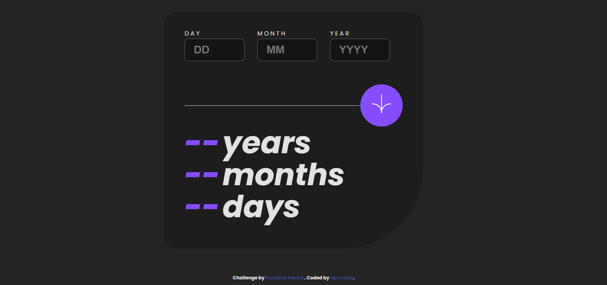

<div align="center">
     
</div>

*Desktop (left) 👈 and Mobile (right) 👉 Views*

<h1 align="center">Frontend Mentor - Age calculator app solution</h1>
<div align="center">
    <h3><a href="https://age-calculator-hermacle.netlify.app">Live Link</a> || <a href="https://www.frontendmentor.io/solutions/age-calculator-using-react-wJ9YE8v_Pw">Solution Link</a></h3>
</div>
<br>

## Table of contents
 
- [Table of contents](#table-of-contents)
- [Overview](#overview)
  - [The challenge](#the-challenge)
  - [Links](#links)
- [My process](#my-process)
  - [Built with](#built-with)
  - [What I learned](#what-i-learned)
  - [Useful resources](#useful-resources)
- [Author](#author)


## Overview

### The challenge

Users should be able to:

- View an age in years, months, and days after submitting a valid date through the form
- Receive validation errors if:
  - Any field is empty when the form is submitted
  - The day number is not between 1-31
  - The month number is not between 1-12
  - The year is in the future
  - The date is invalid e.g. 31/04/1991 (there are 30 days in April)
- View the optimal layout for the interface depending on their device's screen size
- See hover and focus states for all interactive elements on the page

 
### Links

- Solution URL: [Solution URL](https://your-solution-url.com)
- Live Site URL: [Live site URL](https://your-live-site-url.com)

## My process

In this project, I encountered several challenges while implementing the precise calculation of age based on the user-provided date of birth. One of the main hurdles was accurately handling variations in counting years, months, and days due to leap years and differences in days in each month.

The logic for calculating age required a meticulous approach to ensure maximum accuracy. I had to consider the exact number of days in each month, taking into account leap years for February. Additionally, managing cases where the user enters a date close to the current date added further complexity to the calculation.

In addition to the challenges related to age calculation, I also faced difficulties in validating input fields to ensure that the data provided by the user was correct and complete. Handling errors and effectively communicating with the user in case of issues were crucial aspects of developing this functionality.

Despite these challenges, I persevered to overcome the obstacles and provide users with a smooth and accurate experience when calculating their age. By combining a responsive approach with robust calculation logic, I worked to deliver a reliable and user-friendly solution for determining age based on the user's date of birth.

### Built with

- [React](https://reactjs.org/) - JS library
- HTML5 
- CSS 

### What I learned

- Understanding the usage of `new Date()` to obtain the current date and perform temporal comparisons.
- Managing `useState` to maintain and update component state in React functional components.
- Implementing validation logic to ensure correct and complete data in input fields.
- Precise age calculation considering leap years, the exact number of days in each month, and variations in counting years, months, and days.

Example of `new Date()` code usage:

```javascript
// Create a new Date object with the current date and time
const currentDate = new Date();

// Get the current year, month, and day
const currentYear = currentDate.getFullYear();
const currentMonth = currentDate.getMonth() + 1; // Note: Month is zero-based
const currentDay = currentDate.getDate();

console.log(`Current Date: ${currentYear}-${currentMonth}-${currentDay}`);
```
 
### Useful resources

- [Objects Date JS](https://developer.mozilla.org/en-US/docs/Web/JavaScript/Reference/Global_Objects/Date) - This is an amazing resource that helped me finally understand Date objects. I'd recommend it to anyone still learning this concept.

## Author

- GitHub - [Hermacle](https://github.com/Hermacle)
- LinkedIn - [hermacle-kih](https://www.linkedin.com/in/hermacle-kih)
- Twitter - [@Hermacle_kih](https://twitter.com/Hermacle_kih_)
 
